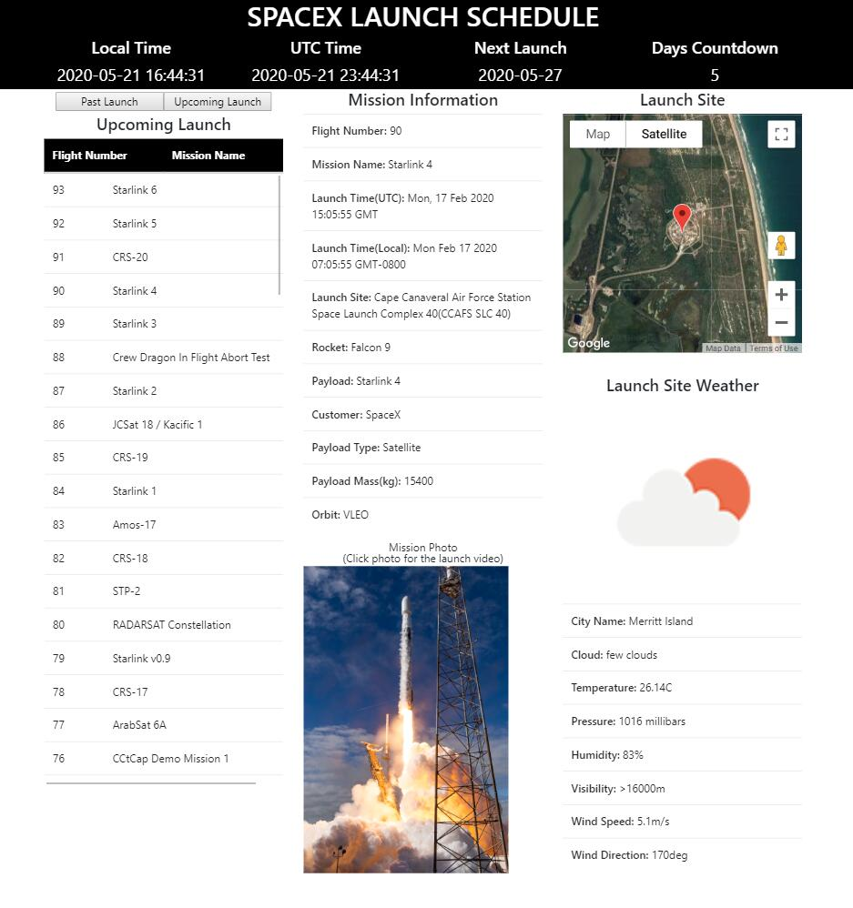

# Spacex Launch Schedule

A JavaScript application for space enthusiast to check all SpaceX launch schedule.

## Technologies Used

- JavaScript
- HTML5
- CSS3
- Node.js
- Express
- Node Fetch
- Webpack
- Google Maps Platform API
- OpenWeatherMap API
- npm
- AWS EC2

## Live Demo

Link: https://spacex-launch.yizhou-liu.com/



## Features

- Users can view all scheduled SpaceX missions
- Users can view all past SpaceX missions
- Users can view the countdown for next mission
- Users can view the mission photo for past missions
- Users can check the current weather at launch pad

## Planned
-TBD

## Getting Started

### Prerequisites
* Node.js 10 or higher
* NPM 6 or higher
* A Google Map API key
* An OpenWeaterMap API key

### API Requirements
* To run this app locally, you will need a Google Maps billing account and API key. Free trials are available and more information can be found at https://developers.google.com/maps/gmp-get-started.

* You will also need an OpenWeatherMap API key. Free trials are available at https://openweathermap.org/api.


### Environment Setup

1. Clone the repository.
    ```shell
    $ git clone https://github.com/yizhou-liu93/SpaceX-Launch.git
    ```
2. Once inside the project directory, install the dependencies.
    ```shell
    $ npm install
    ```
3. Copy the `.env.example` file & name it `.env`.
    ```shell
    $ cp .env.example .env
    ```
4. Edit the `.env` file to include your API credential.
    ```
    PORT=3001
    DEV_SERVER_PORT=3000
    OPENWEATHERMAP_KEY=<YOUR_KEY_HERE>

    ```
5. Use your the Google Map API Key in index.html in directory server/public   
    ```html
    <script
        src="https://maps.googleapis.com/maps/api/js?key=<YOUR_GOOGLE_KEY>&callback=myLib.init" 
            async defer></script>

    ```

6. Run the dev script & visit http://localhost:3000 on your browser
    ```shell
    $ npm run dev
    ```
